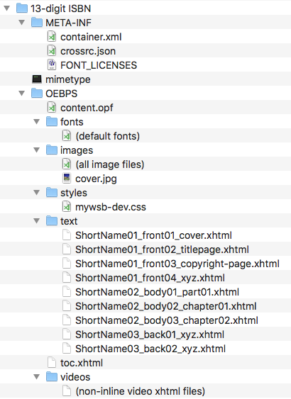

## File Naming Conventions

Name the EPUB project files and folders according to the following conventions.

<table><tr><th>File/Folder</th><th>Naming Convention</th></tr><tr><td>Root project folder</td><td>_13-digit ISBN_</td></tr><tr><td>EPUB package and container files</td><td>Use the conventions shown in the Directory Structure section below.</td></tr><tr><td>Fonts</td><td>Include all default style sheet fonts.</td></tr><tr><td>Images</td><td>Include one cover image _(1333x2000 minimum), named cover.jpg_, along with all book images and video poster SVGs.</td></tr><tr><td>Styles</td><td>Include only mywsb-dev.css</td></tr><tr><td>Videos</td><td>Include one XHTML document with video markup **for each each non-inline video** (more common with glossaries and notes).</td></tr><tr><td>Text</td><td>Each XHTML file should be named with:<ol><li>Short name</li><li>One of three numbers + type, expressing order:<ul><li>01_front = frontmatter</li><li>02_body = bodymatter</li><li>03_back = backmatter</li></ul></li><li>Sequence number + section name as shown by example below</li></ol></td></tr><tr><td>Text: Front Matter</td><td>ShortName01_front01_cover.xhtml<br />ShortName01_front02_titlepage.xhtml<br />ShortName01_front03_copyright-page.xhtml<br />ShortName01_front04_xyz.xhtml (etc.)<br /><br /><em>The section numbers should be sequential, starting with 01, and the name that follows the number should correspond to the `epub:type` in the document or a brief, descriptive name if there is no corresponding type.</em><br /><br /><em>Exception: name abbreviation documents "abbr" rather than "glossary."</em></td></tr><tr><td>Text: Main Content</td><td>ShortName02_body01_part01.xhtml<br />ShortName02_body02_chapter01.xhtml<br />ShortName02_body03_chapter02.xhtml (etc.)<br /><br /><em>Section numbers should be sequential for bodymatter as well, followed by either "part" or "chapter" along with its order (part01, chapter99, etc).</em></td></tr><tr><td>Text: Back Matter</td><td>ShortName03_back01_xyz.xhtml (etc.)<br /><br /><em>As with frontmatter, backmatter section numbers should be sequential, starting with 01, and the name that follows the number should correspond to the `epub:type` in the document.</em></td></tr></table>

## Directory Structure

<aside class="notice">The [latest styleguide-aligned EPUB container](https://github.com/bhdirect-ebooks/epub-container) is always available on GitHub.</aside>

Use the following directory structure for each EPUB:



## Package and Container Files

The primary package and container files are referenced here in their expected basic forms, but it is beyond the scope of this documentation to describe the EPUB specification in detail. For a better understanding of EPUB and related specifications, please use the [documents available to the team in Alfresco](https://cms.lifeway.com/share/page/site/bh-academic/folder-details?nodeRef=workspace://SpacesStore/72fd3c44-683e-4532-974e-458e8c87f0ca).

### mimetype

The mimetype doc is the same for every EPUB we develop:

```plain
application/epub+zip
```

### container.xml

The container.xml is also the same for every EPUB.

```xml
<?xml version="1.0"?>
<container version="1.0" xmlns="urn:oasis:names:tc:opendocument:xmlns:container">
  <rootfiles>
    <rootfile full-path="content.opf" media-type="application/oebps-package+xml"/>
  </rootfiles>
</container>
```

### content.opf

The content.opf is [available here in its basic form](https://github.com/bhdirect-ebooks/epub-container/blob/master/OEBPS/content.opf).

Metadata and included files will vary from one publication to the next, but the link above gives a good overview of the form. For information on `metadata`, see the [Metadata](metadata.html) section.

***Every content file in the EPUB package must be referenced in the manifest.***

### toc.xhtml

The toc.xhtml is the navigation document for the EPUBs we develop. The children of `<body>` must be `<nav>` elements.

The [linked toc.xhtml shows the basic form](https://github.com/bhdirect-ebooks/epub-container/blob/master/OEBPS/toc.xhtml). See [Navigation Document](navigation.html#Navigation-Document) for necessary specifics.
