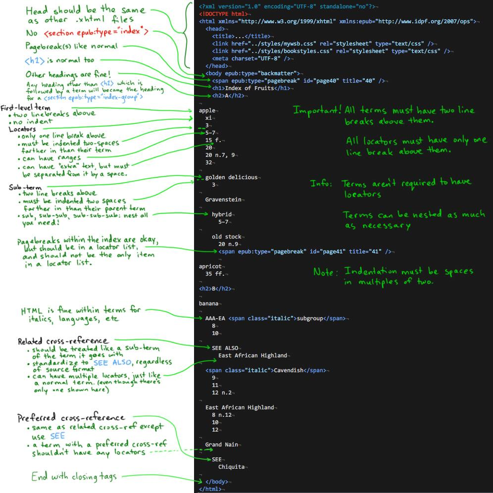

title: Indexes
---

## "Skeletal Index" Formatting

Code all index backmatter files to the following standard:

Sample:[skeletal_index.xhtml](../assets/skeletal_index.xhtml)

<aside class="caution">Before performing the conversion below, make sure you have a correct `page-list` in toc.xhtml, since epubindex uses it for creating hrefs.</aside>

## Converting to EPUB Indexes

[https://github.com/bhdirect-ebooks/epubindex](https://github.com/bhdirect-ebooks/epubindex)

* Open terminal and clone the above repo by entering: `git clone https://github.com/bhdirect-ebooks/epubindex`
* cd into /epubindex and run `sudo npm install -g` to install on your system
* Navigate into the directory of the EPUB for which you want to convert indexes
* All files in /OEBPS/text that contain '_index' in their filename will be processed and overwritten, so be sure to commit all changes before running epubindex
* Run by entering `epubindex`
* You now should have valid epub index files, coded according to the [Indexes](../code/indexes.html) section of Recommended Code.