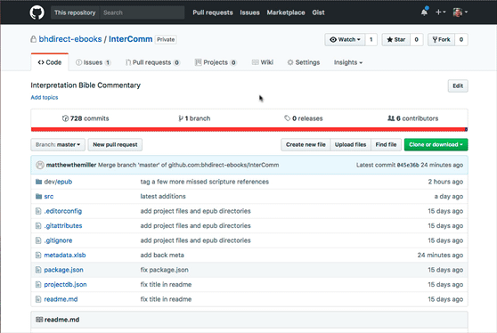

title: Review Process
---

Quality control is the best!

## Related Tools/Scripts

Install [stylecheck](https://github.com/bhdirect-ebooks/stylecheck):

```plain
sudo npm install -g @bhdirect/stylecheck
[enter your network password]
```

Use stylecheck:

```plain
cd [path/to/epub/directory]
stylecheck me
```

***Then check for Scripture errors; search for `error_`***

## Admin

1. Add yourself to the Harvest project and track time against "Review"
2. Add yourself to the Trello card and move it to "In Review"
3. Add any issues to the repo in GitHub
   
4. When complete (and if there are issues), move the card to "Review Issue Resolution"
5. If there are no issues (usually 2nd or later review), move the card to "Ready for Release"

## What to Look For

See [Project Review Rubric](https://docs.google.com/document/d/1J1QP8AWLWvXdtBA10E6fKc_dagvOHtkVN6J5LqQFHjU/).

### Structure & Style

1. Run through EPUB Checker
2. Run through stylecheck

### Checkpoint!

<aside class="warning">Make sure the EPUB passes EpubCheck and stylecheck before moving forward! If you are reviewing another developer's project, do not proceed with Review, and <strong>don't</strong> open issues in GitHub based on these tools. Simply move the Trello card to Review Issue Resolution and alert the developer.</aside>

### Navigation & Package Docs

1. Check toc.xhtml
   * ensure both `toc` nav and `page-list` nav are included according to the style guide
   * ensure toc matches source...
     * ***but***, toc should not be deeply nested; 2 to 3 levels are plenty to not overwhelm the UI
   * ensure no classes are used in any toc item text
   * ensure no leading or trailing spaces exist for any nav entry (both in toc and page-list; check inside `<a></a>` and `<li></li>`)
   * check that each chapter and part is listed (**literally** check for “Chapter” or “Part” at the beginning of each toc entry)
   * each toc item should link to a document + page `id`
   * if the book has parts, check for nesting in toc
   * check that toc.xhtml renders correctly in a browser and nested lists are correct.
2. Check content.opf
   * `spine`
     * ensure the linear order is correct
     * ensure toc.xhtml is not at the top, but rather in its source location
   * `metadata`
     * check for all required meta elements (according to the style guide)

### Code Choice

1. Using stylecheck views, verify quality of
   * headings ... ensure correct semantic structure
   * lists ... check for appropriate nesting and ensure no duplication of list item indicators in the text.
   * tables ... appropriate tagging (future version of stylecheck; for now, check in browser)
2. First character inside `.copyright` classed element must be ©
3. Check for unhandled OCR tags
   * Regex: `<(?:translit|drop|f(?:n|rac)|[ij]n|wksh|[hl]ang|s(?:ig|c(?:rip)?|[tv])|c(?:ap|n)|bq|p(?:[123456]|age|ro)|auth|fix[^>]*?)>`
4. Check for bad paragraph breaks
   * Regex: `<\/p>\s+(<span epub:type="pagebreak"[^>]+>)?\s+<p[^>]*?>(<span[^>]+>(<\/span>)?)?[a-z]`
5. Check pagebreaks
   * do they exist?
   * are they placed appropriately?
     * not in h1-6 but above
     * not breaking Scripture references
     * not as direct children of `<ol>`, `<ul>`, `<dl>`, or `<table>`
6. Check hyperlinks
   * make sure internal linking is only by document + page `id` (links to documents only will result in broken links upon conversion)
7. Check `data-cross-...` attributes
   * search for `data-cross-(?!ref)` to find all of our data attributes in use and ensure they are used according to the style guide
   * check that the JSON values are formatted correctly (`'{"type":"data"}'`)
8. Check tables and media
   * make sure `<figure>`, `<table>`, and `<video>` code blocks have the right markup
   * make sure `` elements include `alt` attributes and are in `<figure>` blocks (or *not* in `<figure>` blocks, if they carry no real meaning in the work itself)
9. Ensure proper code style is followed in all other types of content
   * abbreviation lists and `<abbr>` elements themselves
     * `<abbr>` should only have `title` attribute, no `class` or `id`
   * asides (with or without bridgeheads)
   * bibliographies
   * block quotes (normal and Scripture)
   * footnotes and footnote indicators
   * glossaries
   * indexes
   * pull quotes
10. Look for tags that should be present in specific types of content (refer to [Dev Process Overview](index.html#D-Particular-projects), "Particular Projects")

### Rendered Content

1. Preview some things in the browser (tables, lists, images)
2. Zip to EPUB and check in iBooks
   * check UI TOC button to ensure toc correctness
   * click from TOC to several chapters to test navigation
   * click several footnotes to ensure functionality
   * skim/scan for anomalies or weird rendering